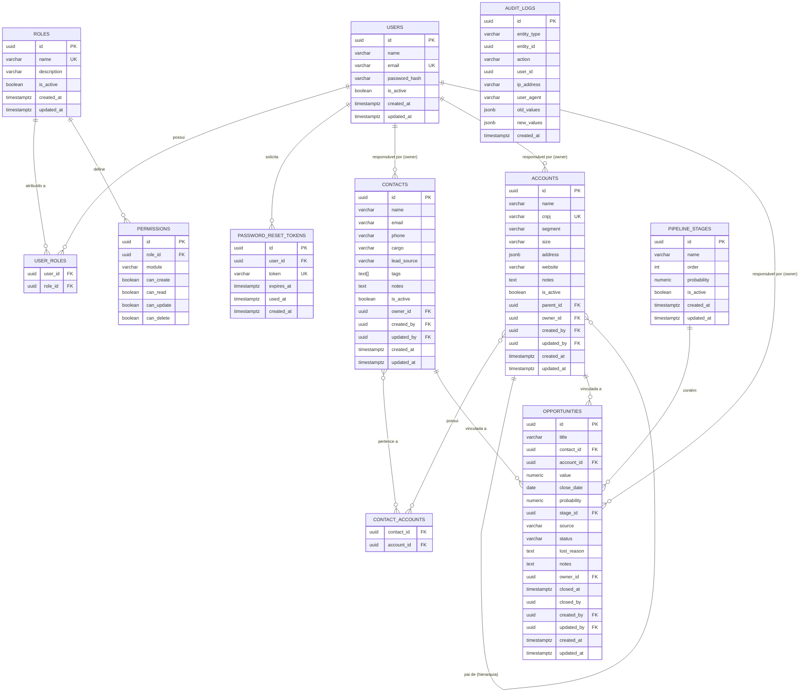

# CRM Backend — UML do Banco de Dados

## Diagrama Entidade-Relacionamento (Mermaid ERD)



---

## Descrição das Tabelas

### `users`
Usuários do sistema. Armazena credenciais com hash bcrypt. Relaciona-se com papéis (`roles`) via tabela de junção.

### `roles`
Papéis de acesso (admin, manager, seller, viewer). Cada papel possui um conjunto de permissões por módulo.

### `user_roles`
Tabela de junção N:N entre `users` e `roles`.

### `permissions`
Permissões por módulo associadas a um papel. Módulos: `contacts`, `accounts`, `opportunities`, `pipeline`, `reports`, `admin`, `audit`.

### `password_reset_tokens`
Tokens temporários para recuperação de senha. Expiram após período configurável e são invalidados após uso.

### `contacts`
Pessoas físicas / prospects do CRM. Suporta tags (array), múltiplas contas vinculadas e rastreio de origem do lead.

### `accounts`
Empresas (contas). Suporta hierarquia matriz/filial via auto-referência `parent_id`. CNPJ único. Endereço armazenado como JSONB.

### `contact_accounts`
Tabela de junção N:N entre `contacts` e `accounts`.

### `pipeline_stages`
Estágios do funil de vendas. Ordenados por `order`. Probabilidade padrão por estágio para cálculo de receita prevista.

### `opportunities`
Oportunidades de venda. Vinculada obrigatoriamente a um contato e uma conta. Status: `active`, `won`, `lost`. Motivo de perda obrigatório quando `status = lost`.

### `audit_logs`
Registro imutável de operações críticas. Armazena estado anterior (`old_values`) e novo (`new_values`) como JSONB. Filtrável por entidade, ação, usuário e período.

---

## Módulos e Entidades (por Domínio)

```
┌─────────────────────────────────────────────────────────────────┐
│  DOMÍNIO: auth                                                    │
│  users · roles · user_roles · permissions · password_reset_tokens│
├─────────────────────────────────────────────────────────────────┤
│  DOMÍNIO: contacts                                                │
│  contacts · contact_accounts                                      │
├─────────────────────────────────────────────────────────────────┤
│  DOMÍNIO: accounts                                                │
│  accounts                                                         │
├─────────────────────────────────────────────────────────────────┤
│  DOMÍNIO: opportunities                                           │
│  pipeline_stages · opportunities                                  │
├─────────────────────────────────────────────────────────────────┤
│  DOMÍNIO: audit                                                   │
│  audit_logs                                                       │
└─────────────────────────────────────────────────────────────────┘
```

> Cada domínio corresponde a um módulo na estrutura de código e é candidato
> a se tornar um microserviço independente em fases futuras.
